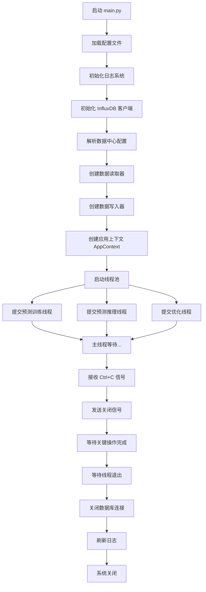

# DC_Energy_conservation 项目架构说明文档

> **版本**: v1.0  
> **更新日期**: 2024年  
> **适用对象**: 新加入项目的开发者、系统维护人员  
> **阅读时长**: 约60分钟

---

## 📚 目录

- [第一部分：项目总体架构](#第一部分项目总体架构)
  - [1.1 项目概述和目标](#11-项目概述和目标)
  - [1.2 核心功能模块划分](#12-核心功能模块划分)
  - [1.3 目录结构说明](#13-目录结构说明)
  - [1.4 技术栈和依赖](#14-技术栈和依赖)
  - [1.5 项目运行流程](#15-项目运行流程)
- [第二部分：数据中心建模体系详解](#第二部分数据中心建模体系详解)
  - [2.1 层次结构总览](#21-层次结构总览)
  - [2.2 基础抽象类详解](#22-基础抽象类详解)
  - [2.3 设备类详解](#23-设备类详解)
  - [2.4 系统级类详解](#24-系统级类详解)
  - [2.5 容器类详解](#25-容器类详解)
  - [2.6 属性类型和数据类型规范](#26-属性类型和数据类型规范)
  - [2.7 UID命名规范](#27-uid命名规范)
- [第三部分：配置文件系统详解](#第三部分配置文件系统详解)
  - [3.1 配置文件清单](#31-配置文件清单)
  - [3.2 uid_config.yaml 完全解析](#32-uid_configyaml-完全解析)
  - [3.3 architecture_config_parser.py 解析机制](#33-architecture_config_parserpy-解析机制)
  - [3.4 其他配置文件说明](#34-其他配置文件说明)
  - [3.5 配置文件最佳实践](#35-配置文件最佳实践)
- [第四部分：数据流和业务逻辑](#第四部分数据流和业务逻辑)
  - [4.1 数据读取流程](#41-数据读取流程)
  - [4.2 数据写入流程](#42-数据写入流程)
  - [4.3 配置到实例的映射过程](#43-配置到实例的映射过程)
  - [4.4 多线程数据处理架构](#44-多线程数据处理架构)
- [第五部分：快速上手指南](#第五部分快速上手指南)
  - [5.1 环境准备](#51-环境准备)
  - [5.2 配置数据中心架构](#52-配置数据中心架构)
  - [5.3 添加新设备的步骤](#53-添加新设备的步骤)
  - [5.4 常见问题和解决方案](#54-常见问题和解决方案)
  - [5.5 调试技巧](#55-调试技巧)
- [附录](#附录)
  - [附录A：完整的类层次结构图](#附录a完整的类层次结构图)
  - [附录B：配置文件模板](#附录b配置文件模板)
  - [附录C：API参考速查](#附录capi参考速查)

---

## 第一部分：项目总体架构

### 1.1 项目概述和目标

**项目名称**: DC_Energy_conservation（数据中心节能AI算法项目）

**项目目标**:
本项目旨在通过AI算法优化数据中心的制冷系统能耗，实现智能化的能源管理。项目支持风冷和水冷两种空调系统，通过实时数据采集、预测模型和优化算法，动态调整设备运行参数，降低整体能耗，提高能源利用效率（PUE值）。

**核心价值**:
1. **实时监控**: 采集数据中心所有设备的运行状态和环境参数
2. **智能预测**: 基于历史数据预测未来设备状态和能耗趋势
3. **优化控制**: 通过AI算法生成最优控制策略，自动调节设备参数
4. **节能降本**: 在保证数据中心正常运行的前提下，最大化降低能耗成本

**技术特点**:
- 🏗️ **层次化建模**: 清晰的四层架构（数据中心 → 机房 → 系统 → 设备）
- 🔧 **配置驱动**: 通过YAML配置文件灵活定义数据中心架构
- 🔒 **容错机制**: 单个设备故障不影响整体系统运行
- 🧵 **多线程架构**: 训练、推理、优化并行执行，互不干扰
- 📊 **多数据库支持**: 支持多个InfluxDB数据库的读写操作

---

### 1.2 核心功能模块划分

项目采用模块化设计，主要包含以下核心功能模块：

#### 📦 模块一：架构建模模块 (`modules/architecture_module.py`)
**功能**: 定义数据中心的完整层次结构模型

**核心类**:
- `DataCenter`: 数据中心顶层容器
- `ComputerRoom`: 机房容器
- `CoolingSystem`: 空调系统基类
- `Device`: 设备基类
- `Attribute`: 属性类

**特点**: 提供统一的数据结构和访问接口

#### 🔧 模块二：配置解析模块 (`utils/architecture_config_parser.py`)
**功能**: 解析YAML配置文件并构建数据中心对象

**核心组件**:
- `DataCenterConfigParser`: 配置解析器类
- `load_datacenter_from_config()`: 便捷加载函数

**特点**: 完善的异常处理和容错机制

#### 💾 模块三：数据读写模块 (`utils/data_read_write.py`)
**功能**: 与InfluxDB交互，读取和写入时序数据

**核心组件**:
- `DataCenterDataReader`: 数据读取器（支持多客户端）
- `DataCenterDataWriter`: 数据写入器（支持多客户端）

**特点**: 配置驱动的灵活数据访问策略

#### 🧠 模块四：预测模块 (`modules/prediction_module.py`)
**功能**: 基于历史数据预测未来设备状态和能耗

**包含线程**:
- 预测训练线程: 周期性训练预测模型
- 预测推理线程: 实时生成预测结果

**特点**: 支持多种预测算法（待实现）

#### ⚙️ 模块五：优化模块 (`modules/optimization_module.py`)
**功能**: 基于预测结果生成最优控制策略

**核心算法**:
- 强化学习优化
- 启发式优化
- 混合优化策略

**特点**: 考虑安全边界约束和业务规则

#### 📝 模块六：日志和监控模块 (`utils/initialization.py`)
**功能**: 提供多层级日志记录和系统监控

**日志类型**:
- 总日志: `total_log.log` - 记录所有日志
- 主程序日志: `main_log.log` - 主流程日志
- InfluxDB日志: `influxdb_log.log` - 数据库操作日志
- 各功能模块独立日志

**特点**: 线程安全，支持日志分级和轮转

---

### 1.3 目录结构说明

```
DC_Energy_conservation/
│
├── DC_Energy_conservation/        # 主程序目录
│   └── main.py                    # 程序入口，多线程调度
│
├── modules/                       # 核心功能模块
│   ├── __init__.py
│   ├── architecture_module.py     # 数据中心架构建模（886行）
│   ├── prediction_module.py       # 预测模块（待实现）
│   └── optimization_module.py     # 优化模块（待实现）
│
├── utils/                         # 工具模块
│   ├── __init__.py
│   ├── architecture_config_parser.py  # 配置解析器（512行）
│   ├── data_read_write.py         # 数据读写封装
│   ├── influxdb_wrapper.py        # InfluxDB客户端封装
│   ├── initialization.py          # 初始化函数（日志、配置）
│   ├── critical_operation.py      # 关键操作保护机制
│   └── data_processing.py         # 数据预处理工具
│
├── configs/                       # 配置文件目录
│   ├── uid_config.yaml            # 数据中心架构和UID映射（核心配置）
│   ├── main_config.yaml           # 主程序配置（线程参数）
│   ├── models_config.yaml         # 模型配置（预测、优化模型参数）
│   ├── modules_config.yaml        # 模块配置（各模块运行参数）
│   ├── utils_config.yaml          # 工具配置（日志、数据库连接）
│   ├── security_boundary_config.yaml  # 安全边界配置（控制约束）
│   └── influxdb_read_write_config.yaml  # 数据读写策略配置
│
├── models/                        # 模型目录
│   └── __init__.py
│
├── pth/                           # 模型权重保存目录
│
├── augment_test/                  # 测试文件目录
│   ├── test_architecture_module.py
│   ├── test_data_config_parser.py
│   └── ...
│
├── augment_caption/               # 文档说明目录
│   ├── 项目接口_说明文档.md
│   └── 项目架构_说明文档.md      # 本文档
│
├── pyproject.toml                 # 项目配置和依赖管理（uv）
├── uv.lock                        # 依赖锁定文件
└── README.md                      # 项目README

```

**目录说明**:
- **DC_Energy_conservation/**: 包含主程序入口 `main.py`
- **modules/**: 存放核心业务逻辑模块
- **utils/**: 存放工具函数和辅助模块
- **configs/**: 存放所有配置文件（YAML格式）
- **models/**: 存放模型定义代码
- **pth/**: 存放训练好的模型权重文件
- **augment_test/**: 存放单元测试和集成测试
- **augment_caption/**: 存放项目文档

---

### 1.4 技术栈和依赖

#### 核心技术栈

| 技术 | 版本 | 用途 |
|------|------|------|
| **Python** | ≥ 3.12 | 主开发语言 |
| **InfluxDB** | ≥ 5.3.2 | 时序数据库，存储设备状态和控制指令 |
| **pandas** | ≥ 2.2.3 | 数据处理和分析 |
| **PyYAML** | ≥ 6.0.3 | YAML配置文件解析 |
| **requests** | ≥ 2.32.5 | HTTP请求（InfluxDB通信） |

#### 依赖管理

项目使用 **uv** 进行依赖管理，具有以下优势：
- ⚡ 极快的依赖解析和安装速度
- 🔒 自动生成锁定文件 `uv.lock`，确保环境一致性
- 📦 内置虚拟环境管理

**安装依赖**:
```bash
# 安装 uv（如果尚未安装）
pip install uv

# 安装项目依赖
uv sync

# 运行项目
uv run python DC_Energy_conservation/main.py
```

#### 开发环境要求

- **操作系统**: Windows / Linux / macOS
- **Python版本**: 3.12 或更高
- **InfluxDB**: 需要预先部署并配置好数据库
- **内存**: 建议 ≥ 8GB（训练模型时）
- **硬盘**: ≥ 10GB（存储日志和模型）

---

### 1.5 项目运行流程

#### 🚀 系统启动流程



#### 🔄 运行时数据流

**1. 预测训练线程**
```
[循环开始]
  ↓
[读取历史数据] ← dc_status_data_client
  ↓
[数据预处理]
  ↓
[训练预测模型]
  ↓
[保存模型] → 写入 pth/ 目录
  ↓
[等待下次训练] (默认3600秒)
  ↓
[检查关闭信号] → 是 → [退出]
  ↓
[循环开始]
```

**2. 预测推理线程**
```
[循环开始]
  ↓
[读取最新状态] ← dc_status_data_client
  ↓
[加载预测模型] ← pth/ 目录
  ↓
[执行预测推理]
  ↓
[写入预测结果] → prediction_data_client
  ↓
[等待下次推理] (默认300秒)
  ↓
[检查关闭信号] → 是 → [退出]
  ↓
[循环开始]
```

**3. 优化线程**
```
[循环开始]
  ↓
[读取预测数据] ← prediction_data_client
  ↓
[读取当前状态] ← dc_status_data_client
  ↓
[执行优化算法]
  ↓
[写入控制指令] → optimization_data_client
  ↓
[等待下次优化] (默认600秒)
  ↓
[检查关闭信号] → 是 → [退出]
  ↓
[循环开始]
```

#### ⚙️ 线程运行模式

项目支持两种线程运行模式（在 `main_config.yaml` 中配置）：

**1. 固定间隔模式 (fixed_interval)**
- 每次循环的总时长固定为 `interval` 秒
- 如果执行时间 < interval，等待剩余时间
- 如果执行时间 ≥ interval，立即开始下一次循环
- **适用场景**: 需要定时执行的任务

**2. 连续运行模式 (continuous)**
- 当前循环结束后立即开始下一次循环
- 不等待固定间隔
- **适用场景**: 需要持续训练或实时响应的任务

**配置示例**:
```yaml
# main_config.yaml
threads:
  prediction_training:
    mode: "fixed_interval"  # 或 "continuous"
    interval: 3600          # 只在 fixed_interval 模式下有效
    error_retry_wait: 60    # 出错后重试等待时间
```

#### 🛡️ 容错机制

**1. 关键操作保护**
- 使用 `critical_operation` 上下文管理器保护重要操作
- 关键操作包括：模型保存、数据库写入
- 优雅关闭时会等待关键操作完成（最多等待 `shutdown_timeout` 秒）

**示例**:
```python
from utils.critical_operation import critical_operation

# 保护模型保存操作
with critical_operation(ctx):
    model.save("checkpoint.pth")
```

**2. 数据验证**
- 读取数据后自动验证数据有效性
- 如果数据无效，等待 `error_retry_wait` 秒后重试
- 避免因数据问题导致程序崩溃

**3. 异常处理**
- 每个线程都有完善的异常捕获
- 单个线程出错不影响其他线程
- 所有异常都会记录到日志

---

## 第二部分：数据中心建模体系详解

### 2.1 层次结构总览

数据中心采用**四层树状层次结构**进行建模，从上到下分别是：

```
DataCenter (数据中心)
    │
    ├── ComputerRoom (机房1)
    │   ├── AirCooledSystem (风冷系统1)
    │   │   ├── AirConditioner_AirCooled (室内空调)
    │   │   │   └── Attribute (属性1, 属性2, ...)
    │   │   ├── Compressor (压缩机)
    │   │   │   └── Attribute (...)
    │   │   ├── Condenser (冷凝器)
    │   │   │   └── Attribute (...)
    │   │   └── ExpansionValve (膨胀阀)
    │   │       └── Attribute (...)
    │   │
    │   ├── WaterCooledSystem (水冷系统1)
    │   │   ├── AirConditioner_WaterCooled (室内空调)
    │   │   ├── Chiller (冷水机组)
    │   │   ├── ChilledWaterPump (冷冻水泵)
    │   │   ├── CoolingWaterPump (冷却水泵)
    │   │   └── CoolingTower (冷却塔)
    │   │
    │   ├── EnvironmentSensor (环境传感器1, 2, ...)
    │   └── room_attributes (机房级别属性)
    │
    ├── ComputerRoom (机房2)
    │   └── ...
    │
    ├── environment_sensors (数据中心环境传感器)
    └── dc_attributes (数据中心级别属性)
```

**层次说明**:

| 层级 | 类名 | 说明 | 示例 |
|------|------|------|------|
| **L1** | `DataCenter` | 数据中心顶层容器 | "北京数据中心" |
| **L2** | `ComputerRoom` | 机房容器，包含多个空调系统 | "A栋1层机房" |
| **L3** | `CoolingSystem` | 空调系统（风冷/水冷） | "A1机房风冷系统1" |
| **L4** | `Device` | 具体设备 | "A1-AC-001" (空调) |
| **L5** | `Attribute` | 设备属性（最小粒度） | "空调送风温度" |

**设计原则**:
1. **自上而下**: 从宏观到微观，逐层细化
2. **父子关系**: 子对象由父对象管理，通过 `add_xxx()` 方法添加
3. **统一访问**: 提供统一的查询接口（`get_xxx()`、`get_all_xxx()`）
4. **容错机制**: 每层都有 `is_available` 标志，支持优雅降级

### 2.2 基础抽象类详解

#### 2.2.1 Attribute（属性类）

**定义位置**: `modules/architecture_module.py` (第24-58行)

**作用**: 表示设备或环境的单个可观测/可调控属性，是系统中的最小数据单元。

**类定义**:
```python
@dataclass
class Attribute:
    name: str                    # 属性名称
    uid: str                     # 属性唯一标识符
    attr_type: str               # 属性类型
    field_key: str = "value"     # 读取时使用的字段键
    value: Optional[float] = None  # 当前值
    unit: Optional[str] = None     # 单位
    description: Optional[str] = None  # 描述
```

**属性类型 (attr_type)**:

| 类型 | 中文名 | 可读/可写 | 数据类型 | 说明 | 示例 |
|------|--------|-----------|----------|------|------|
| `telesignaling` | 遥信 | 只读 | 状态型 | 设备开关状态 | 0=关闭, 1=开启 |
| `telemetry` | 遥测 | 只读 | 数值型 | 温度、功率等 | 25.5℃, 120kW |
| `telecontrol` | 遥控 | 可写 | 状态型 | 开关机指令 | 0=无操作, 1=开机 |
| `teleadjusting` | 遥调 | 可写 | 数值型 | 温度设定值 | 24.0℃ |
| `others` | 其他 | - | - | 保留字段 | - |

**字段键 (field_key)**:
- `value`: 标准值（默认）
- `abs_value`: 绝对值
- `origin_value`: 原始值

**使用示例**:
```python
# 创建一个遥测属性（可观测）
temp_attr = Attribute(
    name="空调送风温度",
    uid="ac_a1_001_supply_temp",
    attr_type="telemetry",
    field_key="value",
    unit="℃",
    description="A1-AC-001 送风温度"
)

# 创建一个遥调属性（可调控）
temp_setpoint_attr = Attribute(
    name="空调送风温度设定点",
    uid="ac_a1_001_supply_temp_setpoint",
    attr_type="teleadjusting",
    field_key="value",
    unit="℃",
    description="A1-AC-001 送风温度设定值"
)
```

**重要说明**:
1. **uid 的唯一性**: 每个属性的 `uid` 在全局范围内唯一，对应 InfluxDB 的 `measurement`
2. **value 动态更新**: `value` 字段由数据读取器从 InfluxDB 读取后动态填充
3. **类型约束**: `attr_type` 决定了属性是否可以被控制（写入）

---

#### 2.2.2 Device（设备基类）

**定义位置**: `modules/architecture_module.py` (第60-121行)

**作用**: 所有设备的抽象父类，定义了设备的通用行为和属性管理接口。

**类定义**:
```python
@dataclass
class Device:
    device_name: str              # 设备名称
    device_uid: str               # 设备唯一标识符
    device_type: str              # 设备类型
    location: Optional[str] = None  # 设备位置
    attributes: Dict[str, Attribute] = field(default_factory=dict)  # 属性字典
    is_available: bool = True     # 设备是否可用
```

**核心方法**:

| 方法名 | 功能 | 参数 | 返回值 |
|--------|------|------|--------|
| `add_attribute()` | 添加属性 | `attr: Attribute` | `None` |
| `get_attribute()` | 获取属性（容错） | `attr_name: str` | `Optional[Attribute]` |
| `get_observable_uids()` | 获取可观测属性uid列表 | 无 | `List[str]` |
| `get_regulable_uids()` | 获取可调控属性uid列表 | 无 | `List[str]` |

**使用示例**:
```python
# 假设已有一个设备实例
device = AirConditioner_AirCooled(
    device_name="A1-AC-001",
    device_uid="AC_A1_001",
    location="A1机房北侧"
)

# 添加属性
device.add_attribute(temp_attr)
device.add_attribute(temp_setpoint_attr)

# 获取属性（容错）
temp = device.get_attribute("空调送风温度")
if temp:
    print(f"当前温度: {temp.value} {temp.unit}")

# 获取所有可观测属性的uid（用于数据读取）
observable_uids = device.get_observable_uids()
# 结果: ["ac_a1_001_supply_temp", "ac_a1_001_return_temp", ...]

# 获取所有可调控属性的uid（用于控制写入）
regulable_uids = device.get_regulable_uids()
# 结果: ["ac_a1_001_supply_temp_setpoint", ...]
```

**设计亮点**:
1. **容错查询**: `get_attribute()` 返回 `Optional`，属性不存在时返回 `None` 而不抛异常
2. **分类查询**: 自动区分可观测和可调控属性，简化数据读写逻辑
3. **is_available 标志**: 支持设备故障时的优雅降级，不可用设备默认不参与数据读写

---

#### 2.2.3 EnvironmentSensor（环境传感器类）

**定义位置**: `modules/architecture_module.py` (第123-162行)

**作用**: 专门用于温度、湿度等环境监测的传感器设备。

**类定义**:
```python
@dataclass
class EnvironmentSensor:
    sensor_name: str              # 传感器名称
    sensor_uid: str               # 传感器唯一标识符
    sensor_type: str = "environment"  # 传感器类型
    location: Optional[str] = None    # 传感器位置
    attributes: Dict[str, Attribute] = field(default_factory=dict)  # 属性字典
```

**核心方法**:

| 方法名 | 功能 | 参数 | 返回值 |
|--------|------|------|--------|
| `add_attribute()` | 添加属性 | `attr: Attribute` | `None` |
| `get_attribute()` | 获取属性（容错） | `attr_name: str` | `Optional[Attribute]` |
| `get_all_uids()` | 获取所有属性uid列表 | 无 | `List[str]` |

**使用示例**:
```python
# 创建环境传感器
temp_sensor = EnvironmentSensor(
    sensor_name="A1机房温度传感器1",
    sensor_uid="ENV_CR_A1_TEMP_001",
    sensor_type="environment",
    location="A1机房北侧"
)

# 添加温度属性
temp_attr = Attribute(
    name="室内环境温度测点1",
    uid="cr_a1_indoor_temp_001",
    attr_type="telemetry",
    field_key="value",
    unit="℃"
)
temp_sensor.add_attribute(temp_attr)

# 获取所有属性uid
all_uids = temp_sensor.get_all_uids()
# 结果: ["cr_a1_indoor_temp_001"]
```

**与 Device 的区别**:
- `EnvironmentSensor` 只有可观测属性（遥信/遥测），没有可调控属性
- 通常挂载在机房或数据中心级别，而非系统级别
- 用于监测环境参数，不参与控制优化

### 2.3 设备类详解

所有具体设备类都继承自 `Device` 基类，分为**风冷系统设备**和**水冷系统设备**两大类。

#### 2.3.1 风冷系统设备

**定义位置**: `modules/architecture_module.py` (第164-240行)

##### (1) AirConditioner_AirCooled（风冷室内空调）

**设备类型**: `AC_AirCooled`

**典型属性**:
- **遥信/遥测**: 空调开关状态、送风温度、回风温度、风机转速、温度设定值设置模式、有功功率、累计能耗
- **遥控/遥调**: 开机设定点、关机设定点、送风温度设定点、回风温度设定点、风机最小/最大转速设定点

**初始化示例**:
```python
ac = AirConditioner_AirCooled(
    device_name="A1-AC-001",
    device_uid="AC_A1_001",
    location="A1机房北侧",
    is_available=True
)
```

##### (2) Compressor（压缩机）

**设备类型**: `COMP`

**典型属性**:
- **遥信/遥测**: 开关状态、频率、有功功率、累计能耗
- **遥控/遥调**: 开机设定点、关机设定点、频率设定点

**能耗特点**: 压缩机是风冷系统中能耗最大的部件，节能重点在于优化压缩机频率

**初始化示例**:
```python
compressor = Compressor(
    device_name="A1-COMP-001",
    device_uid="COMP_A1_001",
    location="A1机房北侧"
)
```

##### (3) Condenser（冷凝器）

**设备类型**: `COND`

**典型属性**:
- **遥信/遥测**: 温度、压力、风机转速、有功功率、累计能耗
- **遥控/遥调**: 风机最小/最大转速设定点

**位置**: 通常安装在室外，负责向室外散热

**初始化示例**:
```python
condenser = Condenser(
    device_name="A1-COND-001",
    device_uid="COND_A1_001",
    location="A1机房室外"
)
```

##### (4) ExpansionValve（膨胀阀）

**设备类型**: `EV`

**典型属性**:
- **遥信/遥测**: 开度
- **遥控/遥调**: 开度设定点

**功能**: 控制制冷剂流量，调节制冷量

**初始化示例**:
```python
expansion_valve = ExpansionValve(
    device_name="A1-EV-001",
    device_uid="EV_A1_001",
    location="A1机房北侧"
)
```

---

#### 2.3.2 水冷系统设备

**定义位置**: `modules/architecture_module.py` (第242-340行)

##### (1) AirConditioner_WaterCooled（水冷室内空调）

**设备类型**: `AC_WaterCooled`

**典型属性**:
- **遥信/遥测**: 开关状态、送风温度、回风温度、风机转速、温度设定值设置模式、**水阀开度**、**冷冻水出水温度**、**冷冻水回水温度**、有功功率、累计能耗
- **遥控/遥调**: 开机设定点、关机设定点、送风温度设定点、回风温度设定点、风机最小/最大转速设定点、**水阀最小/最大开度设定点**

**与风冷空调的区别**: 多了水阀和冷冻水相关属性

**初始化示例**:
```python
ac_water = AirConditioner_WaterCooled(
    device_name="B2-AC-001",
    device_uid="AC_B2_001",
    location="B2机房东侧"
)
```

##### (2) Chiller（冷水机组）

**设备类型**: `CH`

**典型属性**:
- **遥信/遥测**: 开关状态、负荷百分比、用电量、冷冻水出/回水温度、冷却水出/回水温度、有功功率、累计能耗
- **遥控/遥调**: 开机设定点、关机设定点、冷冻水出水温度设定点

**功能**: 水冷系统的核心设备，连接冷冻水和冷却水两个循环

**初始化示例**:
```python
chiller = Chiller(
    device_name="B2-CH-001",
    device_uid="CH_B2_001",
    location="B2机房制冷机房"
)
```

##### (3) ChilledWaterPump（冷冻水泵）

**设备类型**: `CHWP`

**典型属性**:
- **遥信/遥测**: 开关状态、压力、频率反馈、有功功率、累计能耗
- **遥控/遥调**: 开机设定点、关机设定点、频率设定点、冷冻水压差设定点

**功能**: 推动冷冻水循环，将低温冷冻水输送到室内空调

**初始化示例**:
```python
chwp = ChilledWaterPump(
    device_name="B2-CHWP-001",
    device_uid="CHWP_B2_001",
    location="B2机房制冷机房"
)
```

##### (4) CoolingWaterPump（冷却水泵）

**设备类型**: `CWP`

**典型属性**:
- **遥信/遥测**: 开关状态、压力、频率反馈、有功功率、累计能耗
- **遥控/遥调**: 开机设定点、关机设定点、频率设定点、冷却水压差设定点

**功能**: 推动冷却水循环，将热水输送到冷却塔散热

**初始化示例**:
```python
cwp = CoolingWaterPump(
    device_name="B2-CWP-001",
    device_uid="CWP_B2_001",
    location="B2机房制冷机房"
)
```

##### (5) CoolingTower（冷却塔）

**设备类型**: `CT`

**典型属性**:
- **遥信/遥测**: 开关状态、出水温度、回水温度、风机转速、有功功率、累计能耗
- **遥控/遥调**: 开机设定点、关机设定点、风机转速设定点、冷却水出水温度设定点、冷却水温差设定点

**功能**: 利用蒸发冷却原理将热量排放到大气中

**初始化示例**:
```python
cooling_tower = CoolingTower(
    device_name="B2-CT-001",
    device_uid="CT_B2_001",
    location="B2机房楼顶"
)
```

---

### 2.4 系统级类详解

**定义位置**: `modules/architecture_module.py` (第342-449行)

#### 2.4.1 CoolingSystem（空调系统基类）

**作用**: 空调系统的抽象父类，管理一组协同工作的设备。

**类定义**:
```python
@dataclass
class CoolingSystem:
    system_name: str              # 系统名称
    system_uid: str               # 系统唯一标识符
    system_type: str              # 系统类型: "AirCooled" 或 "WaterCooled"
    devices: Dict[str, List[Device]] = field(default_factory=dict)  # 设备字典
    is_available: bool = True     # 系统是否可用
```

**核心方法**:

| 方法名 | 功能 | 参数 | 返回值 |
|--------|------|------|--------|
| `add_device()` | 添加设备 | `device: Device` | `None` |
| `get_devices_by_type()` | 获取指定类型的设备列表 | `device_type: str` | `List[Device]` |
| `get_all_devices()` | 获取系统内所有设备 | `include_unavailable: bool` | `List[Device]` |

**devices 字典结构**:
```python
{
    "AC_AirCooled": [device1, device2, ...],
    "COMP": [device3, ...],
    "COND": [device4, ...],
    ...
}
```

---

#### 2.4.2 AirCooledSystem（风冷空调系统）

**系统类型**: `AirCooled`

**包含设备类型**:
- `AC_AirCooled`: 室内空调
- `COMP`: 压缩机
- `COND`: 冷凝器
- `EV`: 膨胀阀

**使用示例**:
```python
# 创建风冷系统
air_system = AirCooledSystem(
    system_name="A1机房风冷系统1",
    system_uid="ACAC_A1_001",
    is_available=True
)

# 添加设备
air_system.add_device(ac)          # 室内空调
air_system.add_device(compressor)  # 压缩机
air_system.add_device(condenser)   # 冷凝器
air_system.add_device(expansion_valve)  # 膨胀阀

# 查询设备
all_ac = air_system.get_devices_by_type("AC_AirCooled")
all_devices = air_system.get_all_devices()
```

---

#### 2.4.3 WaterCooledSystem（水冷空调系统）

**系统类型**: `WaterCooled`

**包含设备类型**:
- `AC_WaterCooled`: 室内空调
- `CH`: 冷水机组
- `CHWP`: 冷冻水泵
- `CWP`: 冷却水泵
- `CT`: 冷却塔

**使用示例**:
```python
# 创建水冷系统
water_system = WaterCooledSystem(
    system_name="B2机房水冷系统1",
    system_uid="WCAC_B2_001",
    is_available=True
)

# 添加设备
water_system.add_device(ac_water)       # 室内空调
water_system.add_device(chiller)        # 冷水机组
water_system.add_device(chwp)           # 冷冻水泵
water_system.add_device(cwp)            # 冷却水泵
water_system.add_device(cooling_tower)  # 冷却塔
```

### 2.5 容器类详解

**定义位置**: `modules/architecture_module.py` (第451-886行)

#### 2.5.1 ComputerRoom（机房类）

**作用**: 表示数据中心内的单个机房，是系统和设备的容器。

**类定义**:
```python
@dataclass
class ComputerRoom:
    room_name: str                # 机房名称
    room_uid: str                 # 机房唯一标识符
    room_type: str                # 机房类型: "AirCooled"/"WaterCooled"/"Mixed"
    location: Optional[str] = None  # 机房位置
    air_cooled_systems: List[AirCooledSystem] = field(default_factory=list)      # 风冷系统列表
    water_cooled_systems: List[WaterCooledSystem] = field(default_factory=list)  # 水冷系统列表
    environment_sensors: List[EnvironmentSensor] = field(default_factory=list)   # 环境传感器列表
    room_attributes: Dict[str, Attribute] = field(default_factory=dict)          # 机房级别属性
    is_available: bool = True     # 机房是否可用
```

**核心方法（完整列表）**:

| 方法名 | 功能 | 返回值 |
|--------|------|--------|
| `add_air_cooled_system()` | 添加风冷空调系统 | `None` |
| `add_water_cooled_system()` | 添加水冷空调系统 | `None` |
| `add_environment_sensor()` | 添加环境传感器 | `None` |
| `add_room_attribute()` | 添加机房级别属性 | `None` |
| `get_all_systems()` | 获取所有空调系统 | `List[CoolingSystem]` |
| `get_all_devices()` | 获取所有设备 | `List[Device]` |
| `get_all_observable_uids()` | 获取所有可观测属性uid | `List[str]` |
| `get_all_regulable_uids()` | 获取所有可调控属性uid | `List[str]` |
| `get_device_by_uid()` | 根据uid查找设备 | `Optional[Device]` |
| `get_system_by_uid()` | 根据uid查找系统 | `Optional[CoolingSystem]` |
| `get_available_devices()` | 获取可用设备列表 | `List[Device]` |
| `get_unavailable_devices()` | 获取不可用设备列表 | `List[Device]` |
| `get_available_systems()` | 获取可用系统列表 | `List[CoolingSystem]` |
| `get_unavailable_systems()` | 获取不可用系统列表 | `List[CoolingSystem]` |

**使用示例**:
```python
# 创建机房
room = ComputerRoom(
    room_name="A栋1层机房",
    room_uid="CR_A1",
    room_type="AirCooled",
    location="A栋1层",
    is_available=True
)

# 添加风冷系统
room.add_air_cooled_system(air_system)

# 添加环境传感器
room.add_environment_sensor(temp_sensor)

# 添加机房级别属性
room.add_room_attribute(total_power_attr)

# 查询所有可观测属性uid（用于数据读取）
observable_uids = room.get_all_observable_uids()
# 包含: 所有设备属性 + 环境传感器属性 + 机房属性

# 根据uid查找设备（容错）
device = room.get_device_by_uid("AC_A1_001")
if device:
    print(f"找到设备: {device.device_name}")
```

**include_unavailable 参数说明**:

很多查询方法都有 `include_unavailable` 参数：
- `include_unavailable=False` (默认): 只返回可用的系统/设备
- `include_unavailable=True`: 返回所有系统/设备（包括不可用的）

**示例**:
```python
# 只获取可用设备
available_devices = room.get_all_devices(include_unavailable=False)

# 获取所有设备（包括故障设备）
all_devices = room.get_all_devices(include_unavailable=True)
```

---

#### 2.5.2 DataCenter（数据中心类）

**作用**: 数据中心顶层容器类，管理多个机房。

**类定义**:
```python
@dataclass
class DataCenter:
    dc_name: str                  # 数据中心名称
    dc_uid: str                   # 数据中心唯一标识符
    location: Optional[str] = None  # 数据中心位置
    computer_rooms: List[ComputerRoom] = field(default_factory=list)           # 机房列表
    environment_sensors: List[EnvironmentSensor] = field(default_factory=list) # 环境传感器列表
    dc_attributes: Dict[str, Attribute] = field(default_factory=dict)          # 数据中心级别属性
```

**核心方法（完整列表）**:

| 方法名 | 功能 | 返回值 |
|--------|------|--------|
| `add_computer_room()` | 添加机房 | `None` |
| `add_environment_sensor()` | 添加环境传感器 | `None` |
| `add_dc_attribute()` | 添加数据中心级别属性 | `None` |
| `get_all_rooms()` | 获取所有机房 | `List[ComputerRoom]` |
| `get_all_devices()` | 获取所有设备 | `List[Device]` |
| `get_all_observable_uids()` | 获取所有可观测属性uid | `List[str]` |
| `get_all_regulable_uids()` | 获取所有可调控属性uid | `List[str]` |
| `get_room_by_uid()` | 根据uid查找机房 | `Optional[ComputerRoom]` |
| `get_device_by_uid()` | 根据uid在全局查找设备 | `Optional[Device]` |
| `get_available_rooms()` | 获取可用机房列表 | `List[ComputerRoom]` |
| `get_unavailable_rooms()` | 获取不可用机房列表 | `List[ComputerRoom]` |
| `get_statistics()` | 获取统计信息 | `Dict[str, Any]` |

**使用示例**:
```python
# 创建数据中心
datacenter = DataCenter(
    dc_name="示例数据中心",
    dc_uid="DC_001",
    location="北京市海淀区"
)

# 添加机房
datacenter.add_computer_room(room1)
datacenter.add_computer_room(room2)

# 添加数据中心环境传感器
datacenter.add_environment_sensor(outdoor_temp_sensor)

# 添加数据中心级别属性
datacenter.add_dc_attribute(dc_total_power_attr)

# 获取所有可观测属性uid（用于批量数据读取）
all_observable_uids = datacenter.get_all_observable_uids()

# 获取所有可调控属性uid（用于生成控制策略）
all_regulable_uids = datacenter.get_all_regulable_uids()

# 在全局范围内查找设备
device = datacenter.get_device_by_uid("AC_A1_001")

# 获取统计信息
stats = datacenter.get_statistics()
print(f"机房总数: {stats['total_rooms']}")
print(f"设备总数: {stats['total_devices']}")
print(f"可观测点总数: {stats['total_observable_points']}")
```

**get_statistics() 返回的统计信息**:
```python
{
    "total_rooms": 2,                        # 机房总数
    "available_rooms": 2,                    # 可用机房数量
    "unavailable_rooms": 0,                  # 不可用机房数量
    "total_air_cooled_systems": 1,           # 风冷系统总数
    "available_air_cooled_systems": 1,       # 可用风冷系统数量
    "unavailable_air_cooled_systems": 0,     # 不可用风冷系统数量
    "total_water_cooled_systems": 1,         # 水冷系统总数
    "available_water_cooled_systems": 1,     # 可用水冷系统数量
    "unavailable_water_cooled_systems": 0,   # 不可用水冷系统数量
    "total_devices": 9,                      # 设备总数
    "available_devices": 9,                  # 可用设备数量
    "unavailable_devices": 0,                # 不可用设备数量
    "total_observable_points": 68,           # 可观测点总数（只统计可用设备）
    "total_regulable_points": 32             # 可调控点总数（只统计可用设备）
}
```

---

### 2.6 属性类型和数据类型规范

#### 2.6.1 属性类型分类体系

系统采用**四遥**分类体系（遥信、遥测、遥控、遥调），这是工业控制领域的标准分类方法。

| 类型 | 中文名 | 方向 | 数据特征 | 典型应用 | InfluxDB存储 |
|------|--------|------|----------|----------|--------------|
| **telesignaling** | 遥信 | 上行（只读） | 离散状态值 | 开关状态、告警信号 | `measurement=uid, field=value, value={0,1}` |
| **telemetry** | 遥测 | 上行（只读） | 连续数值 | 温度、功率、转速 | `measurement=uid, field=value, value=float` |
| **telecontrol** | 遥控 | 下行（可写） | 离散控制指令 | 开机、关机指令 | `measurement=uid, field=value, value={0,1}` |
| **teleadjusting** | 遥调 | 下行（可写） | 连续控制值 | 温度设定值、频率设定点 | `measurement=uid, field=value, value=float` |

**分类依据**:
1. **方向**: 上行（设备→系统）vs 下行（系统→设备）
2. **数据类型**: 离散状态 vs 连续数值
3. **可写性**: 只读 vs 可写

---

#### 2.6.2 数据类型约束

**整数类型** (多用于状态值):
- 开关状态: `0` = 关闭, `1` = 开启
- 模式选择: `0` = 送风模式, `1` = 回风模式
- 控制指令: `0` = 无操作, `1` = 执行

**浮点类型** (多用于测量值和设定值):
- 温度: 单位℃，精度0.1℃，范围[-50, 100]
- 功率: 单位kW，精度0.01kW，范围[0, 1000]
- 能耗: 单位kWh，精度0.01kWh，范围[0, ∞)
- 转速: 单位rpm，精度1rpm，范围[0, 10000]
- 开度: 单位%，精度0.1%，范围[0, 100]
- 压力: 单位MPa，精度0.01MPa，范围[0, 10]

**建议**: 在 `security_boundary_config.yaml` 中定义每个属性的取值范围和约束条件。

---

### 2.7 UID命名规范

#### 2.7.1 UID的作用

`uid` 是系统中最重要的标识符，具有以下作用：
1. **全局唯一性**: 在整个数据中心范围内唯一标识一个属性
2. **数据库映射**: 直接对应 InfluxDB 的 `measurement` 名称
3. **配置引用**: 在配置文件中引用具体属性
4. **代码访问**: 在代码中通过 uid 读写数据

---

#### 2.7.2 推荐的命名规范

虽然系统对 uid 格式没有强制要求，但建议遵循以下规范以提高可维护性：

**格式模板**:
```
{设备类型缩写}_{机房标识}_{设备编号}_{属性名称}[_setpoint]
```

**示例**:

| 属性描述 | uid 示例 | 说明 |
|----------|----------|------|
| A1机房空调001送风温度 | `ac_a1_001_supply_temp` | 遥测属性 |
| A1机房空调001送风温度设定点 | `ac_a1_001_supply_temp_setpoint` | 遥调属性 |
| A1机房压缩机001频率 | `comp_a1_001_frequency` | 遥测属性 |
| B2机房冷水机组001开关状态 | `ch_b2_001_switch_status` | 遥信属性 |
| B2机房冷却塔001开机设定点 | `ct_b2_001_on_setpoint` | 遥控属性 |
| A1机房室内温度测点1 | `cr_a1_indoor_temp_001` | 环境传感器 |
| 数据中心室外温度 | `dc_outdoor_temp_001` | 数据中心级传感器 |

**设备类型缩写表**:

| 设备类型 | 缩写 | 说明 |
|----------|------|------|
| AirConditioner (风冷) | `ac` | 室内空调 |
| Compressor | `comp` | 压缩机 |
| Condenser | `cond` | 冷凝器 |
| ExpansionValve | `ev` | 膨胀阀 |
| Chiller | `ch` | 冷水机组 |
| ChilledWaterPump | `chwp` | 冷冻水泵 |
| CoolingWaterPump | `cwp` | 冷却水泵 |
| CoolingTower | `ct` | 冷却塔 |
| ComputerRoom | `cr` | 机房级属性 |
| DataCenter | `dc` | 数据中心级属性 |

**命名原则**:
1. **小写字母**: 全部使用小写字母和下划线
2. **语义清晰**: 从 uid 能够直观理解属性含义
3. **层次体现**: 体现设备所属的机房和系统
4. **区分控制点**: 控制属性（遥控/遥调）使用 `_setpoint` 后缀

## 第三部分：配置文件系统详解

### 3.1 配置文件清单

项目采用**配置驱动**的设计理念，所有配置文件都位于 `configs/` 目录下。

| 配置文件 | 作用 | 主要内容 | 修改频率 |
|----------|------|----------|----------|
| **uid_config.yaml** | 数据中心架构定义 | 机房、系统、设备、属性的完整层次结构和UID映射 | ⭐⭐⭐⭐⭐ 高 |
| **main_config.yaml** | 主程序配置 | 线程运行参数、关闭超时 | ⭐⭐⭐ 中 |
| **models_config.yaml** | 模型配置 | 预测模型、优化模型的超参数 | ⭐⭐⭐⭐ 中高 |
| **modules_config.yaml** | 模块配置 | 各功能模块的运行参数 | ⭐⭐⭐ 中 |
| **security_boundary_config.yaml** | 安全边界配置 | 控制范围、约束条件、安全限制 | ⭐⭐ 低 |
| **utils_config.yaml** | 工具配置 | 日志配置、InfluxDB连接信息 | ⭐⭐ 低 |
| **influxdb_read_write_config.yaml** | 数据读写策略配置 | 读写操作的配置键和参数 | ⭐⭐⭐ 中 |

---

### 3.2 uid_config.yaml 完全解析

#### 3.2.1 配置文件结构

`uid_config.yaml` 是**最核心**的配置文件，定义了整个数据中心的架构。总共770行，采用层次化的YAML结构。

**顶层结构**:
```yaml
datacenter:                          # 数据中心根节点
  name: "示例数据中心"               # 数据中心名称
  uid: "DC_001"                      # 数据中心UID
  location: "北京市海淀区"           # 位置

  environment_sensors: [...]         # 数据中心级别环境传感器
  datacenter_attributes: [...]       # 数据中心级别属性

  computer_rooms:                    # 机房列表
    - room_name: "A栋1层机房"        # 机房1
      room_uid: "CR_A1"
      room_type: "AirCooled"
      ...
    - room_name: "B栋2层机房"        # 机房2
      room_uid: "CR_B2"
      room_type: "WaterCooled"
      ...
```

---

#### 3.2.2 数据中心级别配置

**环境传感器配置** (第10-31行):
```yaml
environment_sensors:
  - sensor_name: "室外温度传感器1"
    sensor_uid: "ENV_DC_TEMP_001"
    location: "数据中心楼顶"
    attributes:
      - name: "室外环境温度"
        uid: "dc_outdoor_temp_001"
        attr_type: "telemetry"
        field_key: "value"
        unit: "℃"
        description: "数据中心室外环境温度"
```

**数据中心级别属性配置** (第34-48行):
```yaml
datacenter_attributes:
  - name: "数据中心总有功功率"
    uid: "dc_total_power_001"
    attr_type: "telemetry"
    field_key: "value"
    unit: "kW"
    description: "数据中心总有功功率"
```

**字段说明**:
- `sensor_name` / `name`: 传感器/属性的显示名称
- `sensor_uid` / `uid`: 唯一标识符（对应InfluxDB的measurement）
- `attr_type`: 属性类型（telesignaling/telemetry/telecontrol/teleadjusting）
- `field_key`: 读取数据时使用的字段键，默认为"value"
- `unit`: 单位（可选）
- `description`: 描述信息（可选）

---

#### 3.2.3 机房级别配置

**机房基本信息** (第52-56行):
```yaml
computer_rooms:
  - room_name: "A栋1层机房"
    room_uid: "CR_A1"
    room_type: "AirCooled"           # 机房类型: AirCooled/WaterCooled/Mixed
    location: "A栋1层"
    is_available: True                # 机房是否可用
```

**机房环境传感器** (第59-89行):
```yaml
environment_sensors:
  - sensor_name: "A1机房温度传感器1"
    sensor_uid: "ENV_CR_A1_TEMP_001"
    location: "A1机房北侧"
    attributes:
      - name: "室内环境温度测点1"
        uid: "cr_a1_indoor_temp_001"
        attr_type: "telemetry"
        field_key: "value"
        unit: "℃"
```

**机房级别属性** (第91-103行):
```yaml
room_attributes:
  - name: "机房总有功功率"
    uid: "cr_a1_total_power"
    attr_type: "telemetry"
    field_key: "value"
    unit: "kW"
```

---

#### 3.2.4 风冷系统配置

**风冷系统结构** (第105-316行):
```yaml
air_cooled_systems:
  - system_name: "A1机房风冷系统1"
    system_uid: "ACAC_A1_001"
    is_available: True

    air_conditioners: [...]      # 室内空调列表
    compressors: [...]           # 压缩机列表
    condensers: [...]            # 冷凝器列表
    expansion_valves: [...]      # 膨胀阀列表
```

**室内空调配置示例** (第112-196行):
```yaml
air_conditioners:
  - device_name: "A1-AC-001"
    device_uid: "AC_A1_001"
    location: "A1机房北侧"
    is_available: True
    attributes:
      # 遥信/遥测属性
      - name: "空调开关状态"
        uid: "ac_a1_001_switch_status"
        attr_type: "telesignaling"
        field_key: "value"
        description: "0=关闭, 1=开启"

      - name: "空调送风温度"
        uid: "ac_a1_001_supply_temp"
        attr_type: "telemetry"
        field_key: "value"
        unit: "℃"

      # ... 更多遥信/遥测属性

      # 遥控/遥调属性
      - name: "空调开机设定点"
        uid: "ac_a1_001_on_setpoint"
        attr_type: "telecontrol"
        field_key: "value"
        description: "0=无操作, 1=开机"

      - name: "空调送风温度设定点"
        uid: "ac_a1_001_supply_temp_setpoint"
        attr_type: "teleadjusting"
        field_key: "value"
        unit: "℃"

      # ... 更多遥控/遥调属性
```

**其他设备配置**:
- 压缩机 (第198-246行)
- 冷凝器 (第248-296行)
- 膨胀阀 (第298-316行)

---

#### 3.2.5 水冷系统配置

**水冷系统结构** (第371-770行):
```yaml
water_cooled_systems:
  - system_name: "B2机房水冷系统1"
    system_uid: "WCAC_B2_001"
    is_available: True

    air_conditioners: [...]      # 室内空调列表
    chillers: [...]              # 冷水机组列表
    chilled_water_pumps: [...]   # 冷冻水泵列表
    cooling_water_pumps: [...]   # 冷却水泵列表
    cooling_towers: [...]        # 冷却塔列表
```

**水冷室内空调配置示例** (第378-492行):
```yaml
air_conditioners:
  - device_name: "B2-AC-001"
    device_uid: "AC_B2_001"
    location: "B2机房东侧"
    is_available: True
    attributes:
      # 与风冷空调类似的属性
      - name: "空调开关状态"
        uid: "ac_b2_001_switch_status"
        attr_type: "telesignaling"
        field_key: "value"

      # 水冷特有属性
      - name: "水阀开度"
        uid: "ac_b2_001_valve_opening"
        attr_type: "telemetry"
        field_key: "value"
        unit: "%"

      - name: "冷冻水出水温度"
        uid: "ac_b2_001_chw_supply_temp"
        attr_type: "telemetry"
        field_key: "value"
        unit: "℃"

      # 水冷特有控制属性
      - name: "水阀最小开度设定点"
        uid: "ac_b2_001_valve_min_opening_setpoint"
        attr_type: "teleadjusting"
        field_key: "value"
        unit: "%"
```

**其他水冷设备配置**:
- 冷水机组 (第494-572行)
- 冷冻水泵 (第574-634行)
- 冷却水泵 (第636-696行)
- 冷却塔 (第698-770行)

### 3.3 architecture_config_parser.py 解析机制

#### 3.3.1 解析器类概述

**定义位置**: `utils/architecture_config_parser.py` (512行)

**核心类**: `DataCenterConfigParser`

**主要功能**:
1. 读取并验证 `uid_config.yaml` 配置
2. 递归构建 `DataCenter` 对象层次结构
3. 提供完善的异常处理和容错机制
4. 记录详细的解析日志

---

#### 3.3.2 解析流程

**总体流程**:
```
[加载uid_config字典]
    ↓
[创建DataCenterConfigParser]
    ↓
[调用parse_datacenter()]
    ↓
[解析数据中心基本信息]
    ↓
[解析数据中心环境传感器] → _parse_environment_sensor()
    ↓
[解析数据中心属性] → _parse_attribute()
    ↓
[遍历机房列表]
    ↓
[解析每个机房] → _parse_computer_room()
    ↓               ├─ 解析机房环境传感器
                    ├─ 解析机房属性
                    ├─ 解析风冷系统 → _parse_air_cooled_system()
                    └─ 解析水冷系统 → _parse_water_cooled_system()
    ↓
[返回完整DataCenter对象]
```

---

#### 3.3.3 关键方法详解

**1. parse_datacenter() - 解析数据中心** (第78-152行)

```python
def parse_datacenter(self) -> DataCenter:
    """
    解析整个数据中心配置并返回 DataCenter 对象

    步骤:
    1. 验证必填字段 (name, uid)
    2. 创建 DataCenter 对象
    3. 解析数据中心环境传感器
    4. 解析数据中心属性
    5. 遍历解析机房列表
    6. 输出统计信息
    """
```

**验证机制**:
```python
# 验证必填字段
required_fields = ['name', 'uid']
for field in required_fields:
    if field not in dc_config:
        raise ValueError(f"数据中心配置缺少必填字段: {field}")
```

**2. _parse_computer_room() - 解析机房** (第154-224行)

```python
def _parse_computer_room(self, room_config: Dict) -> ComputerRoom:
    """
    解析单个机房配置

    步骤:
    1. 验证必填字段 (room_name, room_uid, room_type)
    2. 创建 ComputerRoom 对象
    3. 解析机房环境传感器
    4. 解析机房属性
    5. 解析风冷系统（如果有）
    6. 解析水冷系统（如果有）
    """
```

**3. _parse_air_cooled_system() - 解析风冷系统** (第226-294行)

```python
def _parse_air_cooled_system(self, system_config: Dict) -> AirCooledSystem:
    """
    解析风冷系统配置

    步骤:
    1. 验证必填字段 (system_name, system_uid)
    2. 创建 AirCooledSystem 对象
    3. 解析室内空调列表
    4. 解析压缩机列表
    5. 解析冷凝器列表
    6. 解析膨胀阀列表
    """
```

**4. _parse_device() - 解析设备（通用方法）** (第376-414行)

```python
def _parse_device(self, device_config: Dict, device_class: Type[Device]) -> Device:
    """
    解析设备配置（通用方法）

    参数:
        device_config: 设备配置字典
        device_class: 设备类（如 AirConditioner_AirCooled, Compressor 等）

    步骤:
    1. 验证必填字段 (device_name, device_uid)
    2. 创建设备对象（通过device_class动态创建）
    3. 解析设备属性列表
    """
```

**动态类型创建示例**:
```python
# 通过传入的设备类动态创建实例
device = device_class(
    device_name=device_config['device_name'],
    device_uid=device_config['device_uid'],
    location=device_config.get('location'),
    is_available=device_config.get('is_available', True)
)
```

---

#### 3.3.4 容错机制

**1. 单个组件解析失败不影响整体**

```python
# 解析风冷系统
if 'air_cooled_systems' in room_config:
    for system_config in room_config['air_cooled_systems']:
        try:
            system = self._parse_air_cooled_system(system_config)
            room.add_air_cooled_system(system)
            self.logger.info(f"    添加风冷系统: {system.system_name}")
        except Exception as e:
            # 单个系统解析失败，记录警告，继续解析其他系统
            self.logger.warning(f"    解析风冷系统失败: {e}，跳过该系统")
```

**容错等级**:
- **数据中心级别失败**: 抛出异常，程序退出（必填字段）
- **机房级别失败**: 记录错误，跳过该机房
- **系统级别失败**: 记录警告，跳过该系统
- **设备级别失败**: 记录警告，跳过该设备
- **属性级别失败**: 记录警告，跳过该属性

**2. 默认值处理**

```python
# 可选字段使用get()方法，提供默认值
room = ComputerRoom(
    room_name=room_config['room_name'],      # 必填
    room_uid=room_config['room_uid'],        # 必填
    room_type=room_config['room_type'],      # 必填
    location=room_config.get('location'),    # 可选，默认None
    is_available=room_config.get('is_available', True)  # 可选，默认True
)
```

---

#### 3.3.5 使用示例

**方法一：使用DataCenterConfigParser类**

```python
from utils.architecture_config_parser import DataCenterConfigParser
import yaml
import logging

# 1. 加载配置文件
with open('configs/uid_config.yaml', 'r', encoding='utf-8') as f:
    uid_config = yaml.safe_load(f)

# 2. 创建日志器
logger = logging.getLogger("architecture_parser")

# 3. 创建解析器
parser = DataCenterConfigParser(uid_config, logger)

# 4. 解析数据中心
datacenter = parser.parse_datacenter()

# 5. 使用数据中心对象
print(f"数据中心名称: {datacenter.dc_name}")
print(f"机房数量: {len(datacenter.computer_rooms)}")
```

**方法二：使用便捷函数（推荐）**

```python
from utils.architecture_config_parser import load_datacenter_from_config
import yaml
import logging

# 1. 加载配置文件
with open('configs/uid_config.yaml', 'r', encoding='utf-8') as f:
    uid_config = yaml.safe_load(f)

# 2. 创建日志器
logger = logging.getLogger("architecture_parser")

# 3. 一步完成解析
datacenter = load_datacenter_from_config(uid_config, logger)
```

**在main.py中的实际使用** (第588-611行):

```python
# 4. 加载数据中心配置
print("\n[4/7] 加载数据中心配置...")
try:
    datacenter = load_datacenter_from_config(uid_config, loggers["architecture_parser"])

    # 输出统计信息
    stats = datacenter.get_statistics()
    loggers["main"].info(f"数据中心配置加载成功: {datacenter.dc_name}")
    print(f"✓ 数据中心配置加载成功: {datacenter.dc_name}")
    print(f"  - 机房总数: {stats['total_rooms']}")
    print(f"  - 设备总数: {stats['total_devices']}")
    print(f"  - 可观测点总数: {stats['total_observable_points']}")
except Exception as e:
    loggers["main"].error(f"数据中心配置加载失败: {e}", exc_info=True)
    sys.exit(1)
```

---

### 3.4 其他配置文件说明

#### 3.4.1 main_config.yaml（主程序配置）

**作用**: 控制程序运行行为和线程参数

**关键配置**:
```yaml
# 关闭配置
shutdown:
  timeout: 30  # 优雅关闭超时时间（秒）

# 线程配置
threads:
  prediction_training:
    mode: "fixed_interval"  # 运行模式
    interval: 3600          # 间隔时间（秒）
    error_retry_wait: 60    # 出错重试等待（秒）

  prediction_inference:
    mode: "fixed_interval"
    interval: 300
    error_retry_wait: 60

  optimization:
    mode: "fixed_interval"
    interval: 600
    error_retry_wait: 60
```

**参数说明**:
- `mode`: 运行模式
  - `fixed_interval`: 固定间隔模式
  - `continuous`: 连续运行模式
- `interval`: 只在fixed_interval模式下生效，单位为秒
- `error_retry_wait`: 出错后等待多久重试

---

#### 3.4.2 utils_config.yaml（工具配置）

**作用**: 配置日志系统和InfluxDB连接信息

**日志配置示例**:
```yaml
logging:
  log_dir: "logs"
  log_level: "INFO"  # DEBUG/INFO/WARNING/ERROR/CRITICAL
  max_bytes: 10485760  # 10MB
  backup_count: 5

  loggers:
    - name: "total"
      filename: "total_log.log"
      level: "DEBUG"
    - name: "main"
      filename: "main_log.log"
      level: "INFO"
    # ... 更多日志器
```

**InfluxDB连接配置示例**:
```yaml
InfluxDB:
  influxdb_dc_status_data:
    host: "192.168.1.100"
    port: 8086
    username: "admin"
    password: "password"
    database: "dc_status_data"
    timeout: 10
```

---

#### 3.4.3 influxdb_read_write_config.yaml（数据读写策略）

**作用**: 定义数据读写操作的配置键和参数

**读取配置示例**:
```yaml
read_configs:
  datacenter_latest_status:
    client_key: "dc_status_data_client"
    query_type: "latest"
    time_range: "5m"
    uid_source: "datacenter.get_all_observable_uids()"

  latest_predictions:
    client_key: "prediction_data_client"
    query_type: "latest"
    time_range: "15m"
    uid_list: ["sensor_temp_A1", "sensor_temp_B2"]
```

**写入配置示例**:
```yaml
write_configs:
  prediction_by_uid:
    client_key: "prediction_data_client"
    write_type: "separate"
    add_horizon_tag: True

  optimization_unified:
    client_key: "optimization_data_client"
    write_type: "unified"
    measurement_name: "optimization_commands"
    add_auto_execute_tag: True
```

---

### 3.5 配置文件最佳实践

#### 3.5.1 配置文件管理原则

1. **版本控制**: 所有配置文件都应纳入Git版本控制
2. **环境隔离**: 生产环境和测试环境使用不同的配置文件
3. **敏感信息**: 数据库密码等敏感信息应使用环境变量或密钥管理工具
4. **注释完整**: 配置文件中应有清晰的注释说明每个参数的作用
5. **验证机制**: 启动时应验证配置文件的完整性和合法性

---

#### 3.5.2 修改uid_config.yaml的步骤

当需要添加新的机房、系统或设备时：

**步骤1**: 确定新设备的层级位置
```
DataCenter → ComputerRoom → CoolingSystem → Device
```

**步骤2**: 编写设备配置
```yaml
- device_name: "新设备名称"
  device_uid: "NEW_DEVICE_001"
  location: "设备位置"
  is_available: True
  attributes:
    - name: "属性1"
      uid: "new_device_001_attr1"
      attr_type: "telemetry"
      field_key: "value"
      unit: "单位"
```

**步骤3**: 添加到相应的系统配置中
- 风冷设备 → `air_cooled_systems` → 对应的设备列表
- 水冷设备 → `water_cooled_systems` → 对应的设备列表

**步骤4**: 验证配置
```bash
# 运行测试脚本验证配置文件
uv run python augment_test/test_uid_config_loading.py
```

**步骤5**: 重启程序加载新配置

---

#### 3.5.3 配置文件调试技巧

**技巧1**: 使用YAML校验工具
```bash
# 安装yamllint
pip install yamllint

# 校验配置文件
yamllint configs/uid_config.yaml
```

**技巧2**: 逐步添加配置
- 先添加最小可运行配置
- 验证通过后再逐步添加更多设备

**技巧3**: 查看解析日志
- 解析过程的详细日志记录在 `logs/architecture_parser_log.log`
- 解析失败时会有明确的错误提示和行号

**技巧4**: 使用配置模板
- 复制已有的设备配置作为模板
- 修改名称、uid等关键字段

## 第四部分：数据流和业务逻辑

### 4.1 数据读取流程

#### 4.1.1 DataCenterDataReader 概述

**定义位置**: `utils/data_read_write.py`

**作用**: 从InfluxDB读取数据中心的可观测数据（遥信/遥测）

**核心特性**:
1. **配置驱动**: 通过配置文件定义读取策略
2. **多客户端支持**: 可以从多个InfluxDB数据库读取
3. **灵活的uid来源**: 支持从数据中心对象动态获取或手动指定
4. **自动查询构建**: 根据配置自动生成InfluxDB查询语句

---

#### 4.1.2 读取流程图

```
[调用read_influxdb_data()]
    ↓
[获取读取配置] (从influxdb_read_write_config.yaml)
    ↓
[确定uid列表]
    ├─ uid_source: 从datacenter对象动态获取
    └─ uid_list: 使用配置文件中指定的列表
    ↓
[选择InfluxDB客户端] (根据client_key)
    ↓
[构建查询语句] (根据query_type和time_range)
    ↓
[执行查询]
    ↓
[解析查询结果] → Dict[uid, DataFrame]
    ↓
[返回数据]
```

---

#### 4.1.3 使用示例

**示例1: 读取数据中心最新状态**

```python
# 在预测训练线程中
observable_data = ctx.data_reader.read_influxdb_data(
    "dc_status_data_client",      # 客户端键
    "datacenter_latest_status"     # 配置键
)

# 返回结果: Dict[str, pd.DataFrame]
# {
#     "ac_a1_001_supply_temp": DataFrame([...]),
#     "ac_a1_001_return_temp": DataFrame([...]),
#     ...
# }
```

**对应的配置** (influxdb_read_write_config.yaml):
```yaml
read_configs:
  datacenter_latest_status:
    client_key: "dc_status_data_client"
    query_type: "latest"          # 读取最新值
    time_range: "5m"              # 最近5分钟
    uid_source: "datacenter.get_all_observable_uids()"  # 动态获取uid
```

**示例2: 读取指定时间范围的历史数据**

```yaml
read_configs:
  datacenter_history_data:
    client_key: "dc_status_data_client"
    query_type: "range"           # 读取时间范围
    time_range: "1h"              # 最近1小时
    uid_source: "datacenter.get_all_observable_uids()"
```

**示例3: 读取指定uid列表的数据**

```yaml
read_configs:
  specific_sensors:
    client_key: "dc_status_data_client"
    query_type: "latest"
    time_range: "10m"
    uid_list:                     # 手动指定uid列表
      - "cr_a1_indoor_temp_001"
      - "cr_a1_indoor_temp_002"
      - "dc_outdoor_temp_001"
```

---

### 4.2 数据写入流程

#### 4.2.1 DataCenterDataWriter 概述

**定义位置**: `utils/data_read_write.py`

**作用**: 向InfluxDB写入预测结果和优化控制指令

**核心特性**:
1. **两种存储格式**: 按测点分离存储 vs 统一存储
2. **多客户端支持**: 可以写入不同的数据库
3. **标签系统**: 支持添加自定义标签（如horizon、is_auto_execute）
4. **关键操作保护**: 使用critical_operation保护写入过程

---

#### 4.2.2 两种存储格式对比

**格式1: 按测点分离存储 (separate)**

每个uid作为独立的measurement存储：

```
measurement: sensor_temp_A1
time                value
2024-01-01 12:00:00 25.5

measurement: sensor_temp_B2
time                value
2024-01-01 12:00:00 26.1
```

**优点**:
- 查询单个测点性能高
- 符合InfluxDB最佳实践

**配置**:
```yaml
write_configs:
  prediction_by_uid:
    client_key: "prediction_data_client"
    write_type: "separate"
    add_horizon_tag: True  # 添加预测时域标签
```

**调用示例**:
```python
prediction_data = {
    'sensor_temp_A1': 25.5,
    'sensor_temp_B2': 26.1
}
ctx.data_writer.write_influxdb_data(
    'prediction_data_client',
    'prediction_by_uid',
    prediction_data,
    horizon='15mins'  # 预测时域
)
```

**格式2: 统一存储 (unified)**

所有数据存储在同一个measurement中：

```
measurement: predictions
time                uid              value              horizon
2024-01-01 12:00:00 sensor_temp_A1   25.5              15mins
2024-01-01 12:00:00 sensor_temp_B2   26.1              15mins
```

**优点**:
- 便于批量查询和分析
- 适合存储JSON格式的复杂数据

**配置**:
```yaml
write_configs:
  prediction_unified:
    client_key: "prediction_data_client"
    write_type: "unified"
    measurement_name: "predictions"
    add_horizon_tag: True
```

**调用示例（存储JSON）**:
```python
prediction_data = {
    'sensor_temp_A1': '{"value": 25.5, "confidence": 0.95}',
    'sensor_temp_B2': '{"value": 26.1, "confidence": 0.93}'
}
ctx.data_writer.write_influxdb_data(
    'prediction_data_client',
    'prediction_unified',
    prediction_data,
    horizon='1h'
)
```

---

#### 4.2.3 写入流程图

```
[调用write_influxdb_data()]
    ↓
[获取写入配置] (从influxdb_read_write_config.yaml)
    ↓
[选择InfluxDB客户端] (根据client_key)
    ↓
[判断写入类型]
    ├─ separate: 为每个uid创建独立的数据点
    └─ unified: 创建统一的数据点列表
    ↓
[添加标签]
    ├─ horizon: 预测时域（可选）
    └─ is_auto_execute: 是否自动执行（可选）
    ↓
[使用critical_operation保护]
    ↓
[批量写入InfluxDB]
    ↓
[返回成功/失败状态]
```

---

### 4.3 配置到实例的映射过程

#### 4.3.1 完整映射流程

```
[启动程序]
    ↓
[加载所有配置文件] (utils/initialization.py: load_configs())
    ├─ main_config.yaml
    ├─ uid_config.yaml
    ├─ models_config.yaml
    ├─ modules_config.yaml
    ├─ security_boundary_config.yaml
    ├─ utils_config.yaml
    └─ influxdb_read_write_config.yaml
    ↓
[初始化InfluxDB客户端] (utils/influxdb_wrapper.py)
    ├─ dc_status_data_client
    ├─ prediction_data_client
    └─ optimization_data_client
    ↓
[解析数据中心配置] (utils/architecture_config_parser.py)
    ├─ 读取 uid_config
    ├─ 创建 DataCenterConfigParser
    ├─ 递归解析配置
    └─ 返回 DataCenter 对象
    ↓
[创建数据读取器] (utils/data_read_write.py)
    ├─ 传入 datacenter 对象
    ├─ 传入 influxdb_read_write_config
    └─ 传入 InfluxDB 客户端字典
    ↓
[创建数据写入器] (utils/data_read_write.py)
    ├─ 传入 datacenter 对象
    ├─ 传入 influxdb_read_write_config
    ├─ 传入 InfluxDB 客户端字典
    └─ 传入 AppContext
    ↓
[创建应用上下文] (main.py: AppContext)
    ├─ 存储所有配置
    ├─ 存储所有客户端
    ├─ 存储 datacenter 对象
    ├─ 存储 data_reader
    └─ 存储 data_writer
    ↓
[启动多线程]
    ├─ 预测训练线程
    ├─ 预测推理线程
    └─ 优化线程
```

---

#### 4.3.2 关键映射关系

**1. uid_config → DataCenter 对象**

```yaml
# uid_config.yaml
datacenter:
  name: "示例数据中心"
  uid: "DC_001"
  computer_rooms:
    - room_name: "A栋1层机房"
      air_cooled_systems:
        - system_name: "风冷系统1"
          air_conditioners:
            - device_name: "A1-AC-001"
              attributes:
                - uid: "ac_a1_001_supply_temp"
```

映射为：

```python
datacenter = DataCenter(
    dc_name="示例数据中心",
    dc_uid="DC_001"
)
room = ComputerRoom(room_name="A栋1层机房")
system = AirCooledSystem(system_name="风冷系统1")
device = AirConditioner_AirCooled(device_name="A1-AC-001")
attr = Attribute(uid="ac_a1_001_supply_temp")

device.add_attribute(attr)
system.add_device(device)
room.add_air_cooled_system(system)
datacenter.add_computer_room(room)
```

**2. influxdb_read_write_config → 数据访问操作**

```yaml
# influxdb_read_write_config.yaml
read_configs:
  datacenter_latest_status:
    client_key: "dc_status_data_client"
    query_type: "latest"
```

映射为：

```python
# 在线程中调用
data = ctx.data_reader.read_influxdb_data(
    "dc_status_data_client",        # 使用 client_key
    "datacenter_latest_status"       # 使用配置键
)
```

---

### 4.4 多线程数据处理架构

#### 4.4.1 线程职责划分

| 线程名称 | 数据输入 | 数据输出 | 运行频率 | 主要任务 |
|----------|----------|----------|----------|----------|
| **预测训练线程** | 历史状态数据 | 模型文件 | 3600秒 | 训练预测模型 |
| **预测推理线程** | 最新状态数据 | 预测结果 | 300秒 | 生成预测数据 |
| **优化线程** | 预测数据+当前状态 | 控制指令 | 600秒 | 生成优化策略 |

---

#### 4.4.2 数据库使用策略

```
┌─────────────────────────────────────────┐
│   dc_status_data_client (状态数据库)    │
│   存储: 所有设备的实时状态和历史数据     │
└─────────────────────────────────────────┘
         ↓ 读取                    ↓ 读取
    [预测训练线程]            [预测推理线程]
         ↓ 写入模型文件           ↓ 写入
    pth/ 目录               ┌──────────────────────────────┐
         ↓ 读取模型文件        │  prediction_data_client      │
    [预测推理线程]            │  存储: 预测结果             │
                           └──────────────────────────────┘
                                ↓ 读取
                            [优化线程]
                                ↓ 写入
                           ┌──────────────────────────────┐
                           │  optimization_data_client    │
                           │  存储: 优化控制指令          │
                           └──────────────────────────────┘
```

---

#### 4.4.3 线程同步和通信

**1. 无直接线程间通信**
- 各线程独立运行，不通过内存共享数据
- 通过InfluxDB数据库进行间接通信

**2. 统一关闭信号**
- 使用 `ctx.shutdown_event` 通知所有线程退出
- 所有线程定期检查 `ctx.shutdown_event.is_set()`

**3. 关键操作保护**
- 使用 `critical_operation_count` 计数器
- 优雅关闭时等待关键操作完成

**示例**:
```python
# 在线程循环中检查关闭信号
while not ctx.shutdown_event.is_set():
    # 执行任务...

    # 耗时操作中定期检查
    for epoch in range(num_epochs):
        if ctx.shutdown_event.is_set():
            logger.info("检测到关闭信号，中断训练")
            break
        # 训练步骤...
```

## 第五部分：快速上手指南

### 5.1 环境准备

#### 5.1.1 安装Python和uv

**Windows系统**:
```bash
# 1. 安装Python 3.12+
# 下载安装包: https://www.python.org/downloads/

# 2. 验证安装
python --version  # 应显示 Python 3.12.x

# 3. 安装uv
pip install uv

# 4. 验证uv安装
uv --version
```

**Linux/macOS系统**:
```bash
# 1. 安装Python 3.12+ (使用包管理器)
# Ubuntu/Debian:
sudo apt install python3.12

# macOS (使用Homebrew):
brew install python@3.12

# 2. 安装uv
pip3 install uv

# 3. 验证安装
python3 --version
uv --version
```

---

#### 5.1.2 克隆项目并安装依赖

```bash
# 1. 进入项目目录
cd D:/Yulab/Project/DC_Energy_conservation

# 2. 使用uv安装依赖
uv sync

# 3. 验证安装
uv run python -c "import influxdb, pandas, yaml; print('依赖安装成功')"
```

---

#### 5.1.3 配置InfluxDB

**步骤1**: 安装并启动InfluxDB服务

```bash
# 下载InfluxDB: https://www.influxdata.com/downloads/
# 启动服务（示例）
influxd
```

**步骤2**: 创建所需的数据库

```bash
# 使用InfluxDB CLI
influx

# 创建数据库
CREATE DATABASE dc_status_data
CREATE DATABASE prediction_data
CREATE DATABASE optimization_data
```

**步骤3**: 修改 `configs/utils_config.yaml`

```yaml
InfluxDB:
  influxdb_dc_status_data:
    host: "localhost"      # 修改为实际InfluxDB地址
    port: 8086
    username: "admin"      # 修改为实际用户名
    password: "password"   # 修改为实际密码
    database: "dc_status_data"
```

---

### 5.2 配置数据中心架构

#### 5.2.1 理解现有配置结构

打开 `configs/uid_config.yaml`，查看配置结构：

```yaml
datacenter:                    # 数据中心根节点
  name: "示例数据中心"
  uid: "DC_001"
  computer_rooms:              # 机房列表
    - room_name: "A栋1层机房"  # 风冷机房
      ...
    - room_name: "B栋2层机房"  # 水冷机房
      ...
```

---

#### 5.2.2 配置自己的数据中心

**方法1: 修改示例配置**

1. 修改数据中心基本信息
```yaml
datacenter:
  name: "我的数据中心"        # 改为实际名称
  uid: "DC_MY_001"           # 改为实际UID
  location: "实际地址"
```

2. 修改机房信息
```yaml
computer_rooms:
  - room_name: "1号机房"
    room_uid: "CR_01"
    room_type: "AirCooled"   # 或 "WaterCooled"
    location: "1楼东侧"
```

3. 配置设备和属性
- 根据实际设备修改设备名称和uid
- 确保每个uid在全局唯一

**方法2: 从头创建配置**

参考 [附录B：配置文件模板](#附录b配置文件模板)

---

#### 5.2.3 验证配置文件

```bash
# 运行配置验证测试
uv run python augment_test/test_uid_config_loading.py

# 如果配置正确，会输出:
# ✓ 数据中心配置加载成功
# ✓ 机房总数: X
# ✓ 设备总数: Y
```

---

### 5.3 添加新设备的步骤

#### 5.3.1 需求分析

假设要添加一个新的风冷空调设备 "A1-AC-002"。

**步骤1**: 确定设备层级位置
```
数据中心 → A栋1层机房 → 风冷系统1 → 新空调设备
```

---

#### 5.3.2 编写设备配置

在 `configs/uid_config.yaml` 中找到对应的系统配置，添加新设备：

```yaml
air_cooled_systems:
  - system_name: "A1机房风冷系统1"
    system_uid: "ACAC_A1_001"

    air_conditioners:
      # ... 已有设备

      # 添加新设备
      - device_name: "A1-AC-002"
        device_uid: "AC_A1_002"
        location: "A1机房南侧"
        is_available: True
        attributes:
          # 遥信/遥测属性
          - name: "空调开关状态"
            uid: "ac_a1_002_switch_status"
            attr_type: "telesignaling"
            field_key: "value"

          - name: "空调送风温度"
            uid: "ac_a1_002_supply_temp"
            attr_type: "telemetry"
            field_key: "value"
            unit: "℃"

          # 遥控/遥调属性
          - name: "空调开机设定点"
            uid: "ac_a1_002_on_setpoint"
            attr_type: "telecontrol"
            field_key: "value"

          - name: "空调送风温度设定点"
            uid: "ac_a1_002_supply_temp_setpoint"
            attr_type: "teleadjusting"
            field_key: "value"
            unit: "℃"
```

---

#### 5.3.3 验证新设备配置

```bash
# 1. 验证配置文件语法
yamllint configs/uid_config.yaml

# 2. 运行配置加载测试
uv run python augment_test/test_uid_config_loading.py

# 3. 检查日志
cat logs/architecture_parser_log.log | grep "A1-AC-002"
# 应该看到: "添加室内空调: A1-AC-002"
```

---

#### 5.3.4 准备测试数据

在InfluxDB中插入测试数据：

```bash
# 使用InfluxDB CLI
influx

# 切换数据库
USE dc_status_data

# 插入测试数据
INSERT ac_a1_002_switch_status value=1
INSERT ac_a1_002_supply_temp value=24.5
```

---

#### 5.3.5 运行程序验证

```bash
# 运行主程序
uv run python DC_Energy_conservation/main.py

# 观察日志输出
# 应该能看到新设备的数据被读取和处理
```

---

### 5.4 常见问题和解决方案

#### 问题1: 配置文件解析失败

**错误信息**:
```
ValueError: 数据中心配置缺少必填字段: name
```

**原因**: 配置文件缺少必填字段

**解决方案**:
1. 检查错误提示中指出的字段
2. 确保所有必填字段都有值
3. 参考示例配置补充缺失字段

---

#### 问题2: InfluxDB连接失败

**错误信息**:
```
InfluxDBClientError: Unable to connect to InfluxDB
```

**原因**: InfluxDB服务未启动或连接信息错误

**解决方案**:
1. 确认InfluxDB服务正在运行
```bash
# 检查进程
ps aux | grep influxd
```

2. 验证连接信息
```yaml
# utils_config.yaml
host: "localhost"  # 确认地址正确
port: 8086         # 确认端口正确
```

3. 测试连接
```python
from influxdb import InfluxDBClient
client = InfluxDBClient(host='localhost', port=8086)
print(client.ping())  # 应返回版本号
```

---

#### 问题3: 数据读取返回空结果

**现象**: `data_reader.read_influxdb_data()` 返回空字典

**可能原因**:
1. InfluxDB中没有对应uid的数据
2. 时间范围配置不合理
3. field_key配置错误

**排查步骤**:
```bash
# 1. 检查InfluxDB中是否有数据
influx
USE dc_status_data
SHOW MEASUREMENTS  # 查看所有measurement

# 2. 查询具体数据
SELECT * FROM "ac_a1_001_supply_temp" ORDER BY time DESC LIMIT 10

# 3. 检查时间范围
# 如果数据很旧，time_range="5m"可能查不到数据
# 修改为更大的时间范围，如"1h"或"24h"
```

---

#### 问题4: uid命名冲突

**错误信息**:
```
警告: 发现重复的uid: ac_a1_001_supply_temp
```

**原因**: 不同设备使用了相同的uid

**解决方案**:
1. 在配置文件中搜索重复的uid
```bash
grep -n "ac_a1_001_supply_temp" configs/uid_config.yaml
```

2. 修改其中一个设备的uid，确保全局唯一
```yaml
# 错误示例
device_uid: "AC_A1_001"
uid: "ac_a1_001_supply_temp"  # 重复！

# 正确示例
device_uid: "AC_A1_002"
uid: "ac_a1_002_supply_temp"  # 唯一
```

---

### 5.5 调试技巧

#### 5.5.1 启用详细日志

修改 `configs/utils_config.yaml`:

```yaml
logging:
  log_level: "DEBUG"  # 从INFO改为DEBUG
```

重新运行程序，查看详细日志：

```bash
# 查看总日志
tail -f logs/total_log.log

# 查看特定模块日志
tail -f logs/architecture_parser_log.log
tail -f logs/influxdb_log.log
```

---

#### 5.5.2 使用Python交互式调试

```python
# 在代码中添加断点
import pdb; pdb.set_trace()

# 或使用ipdb (需要安装: uv add ipdb)
import ipdb; ipdb.set_trace()

# 运行程序
uv run python DC_Energy_conservation/main.py
```

---

#### 5.5.3 单独测试数据中心解析

```python
# 创建测试脚本 test_my_config.py
import yaml
import logging
from utils.architecture_config_parser import load_datacenter_from_config

# 配置日志
logging.basicConfig(level=logging.DEBUG)
logger = logging.getLogger("test")

# 加载配置
with open('configs/uid_config.yaml', 'r', encoding='utf-8') as f:
    uid_config = yaml.safe_load(f)

# 解析数据中心
try:
    datacenter = load_datacenter_from_config(uid_config, logger)
    print(f"✓ 解析成功: {datacenter.dc_name}")

    # 输出统计信息
    stats = datacenter.get_statistics()
    for key, value in stats.items():
        print(f"  {key}: {value}")

except Exception as e:
    print(f"✗ 解析失败: {e}")
    import traceback
    traceback.print_exc()
```

运行测试：
```bash
uv run python test_my_config.py
```

---

#### 5.5.4 验证InfluxDB查询

```python
# 创建测试脚本 test_influxdb.py
from influxdb import InfluxDBClient

# 创建客户端
client = InfluxDBClient(
    host='localhost',
    port=8086,
    username='admin',
    password='password',
    database='dc_status_data'
)

# 测试查询
query = 'SELECT * FROM "ac_a1_001_supply_temp" ORDER BY time DESC LIMIT 10'
result = client.query(query)

print("查询结果:")
for point in result.get_points():
    print(point)
```

---

## 附录

### 附录A：完整的类层次结构图

```
architecture_module.py 类层次结构
│
├── Attribute (dataclass)
│   ├── name: str
│   ├── uid: str
│   ├── attr_type: str
│   ├── field_key: str
│   ├── value: Optional[float]
│   ├── unit: Optional[str]
│   └── description: Optional[str]
│
├── Device (dataclass)
│   ├── device_name: str
│   ├── device_uid: str
│   ├── device_type: str
│   ├── location: Optional[str]
│   ├── attributes: Dict[str, Attribute]
│   ├── is_available: bool
│   └── 方法:
│       ├── add_attribute()
│       ├── get_attribute()
│       ├── get_observable_uids()
│       └── get_regulable_uids()
│   │
│   ├── AirConditioner_AirCooled (继承Device)
│   │   └── device_type: "AC_AirCooled"
│   │
│   ├── Compressor (继承Device)
│   │   └── device_type: "COMP"
│   │
│   ├── Condenser (继承Device)
│   │   └── device_type: "COND"
│   │
│   ├── ExpansionValve (继承Device)
│   │   └── device_type: "EV"
│   │
│   ├── AirConditioner_WaterCooled (继承Device)
│   │   └── device_type: "AC_WaterCooled"
│   │
│   ├── Chiller (继承Device)
│   │   └── device_type: "CH"
│   │
│   ├── ChilledWaterPump (继承Device)
│   │   └── device_type: "CHWP"
│   │
│   ├── CoolingWaterPump (继承Device)
│   │   └── device_type: "CWP"
│   │
│   └── CoolingTower (继承Device)
│       └── device_type: "CT"
│
├── EnvironmentSensor (dataclass)
│   ├── sensor_name: str
│   ├── sensor_uid: str
│   ├── sensor_type: str
│   ├── location: Optional[str]
│   ├── attributes: Dict[str, Attribute]
│   └── 方法:
│       ├── add_attribute()
│       ├── get_attribute()
│       └── get_all_uids()
│
├── CoolingSystem (dataclass)
│   ├── system_name: str
│   ├── system_uid: str
│   ├── system_type: str
│   ├── devices: Dict[str, List[Device]]
│   ├── is_available: bool
│   └── 方法:
│       ├── add_device()
│       ├── get_devices_by_type()
│       └── get_all_devices()
│   │
│   ├── AirCooledSystem (继承CoolingSystem)
│   │   └── system_type: "AirCooled"
│   │
│   └── WaterCooledSystem (继承CoolingSystem)
│       └── system_type: "WaterCooled"
│
├── ComputerRoom (dataclass)
│   ├── room_name: str
│   ├── room_uid: str
│   ├── room_type: str
│   ├── location: Optional[str]
│   ├── air_cooled_systems: List[AirCooledSystem]
│   ├── water_cooled_systems: List[WaterCooledSystem]
│   ├── environment_sensors: List[EnvironmentSensor]
│   ├── room_attributes: Dict[str, Attribute]
│   ├── is_available: bool
│   └── 方法:
│       ├── add_air_cooled_system()
│       ├── add_water_cooled_system()
│       ├── add_environment_sensor()
│       ├── add_room_attribute()
│       ├── get_all_systems()
│       ├── get_all_devices()
│       ├── get_all_observable_uids()
│       ├── get_all_regulable_uids()
│       ├── get_device_by_uid()
│       ├── get_system_by_uid()
│       ├── get_available_devices()
│       ├── get_unavailable_devices()
│       ├── get_available_systems()
│       └── get_unavailable_systems()
│
└── DataCenter (dataclass)
    ├── dc_name: str
    ├── dc_uid: str
    ├── location: Optional[str]
    ├── computer_rooms: List[ComputerRoom]
    ├── environment_sensors: List[EnvironmentSensor]
    ├── dc_attributes: Dict[str, Attribute]
    └── 方法:
        ├── add_computer_room()
        ├── add_environment_sensor()
        ├── add_dc_attribute()
        ├── get_all_rooms()
        ├── get_all_devices()
        ├── get_all_observable_uids()
        ├── get_all_regulable_uids()
        ├── get_room_by_uid()
        ├── get_device_by_uid()
        ├── get_available_rooms()
        ├── get_unavailable_rooms()
        └── get_statistics()
```

### 附录B：配置文件模板

#### B.1 最小化数据中心配置模板

```yaml
# configs/uid_config.yaml - 最小化配置模板

datacenter:
  name: "我的数据中心"
  uid: "DC_MY_001"
  location: "北京市"

  # 数据中心环境传感器（可选）
  environment_sensors:
    - sensor_name: "室外温度传感器"
      sensor_uid: "ENV_DC_TEMP_001"
      attributes:
        - name: "室外温度"
          uid: "dc_outdoor_temp"
          attr_type: "telemetry"
          field_key: "value"
          unit: "℃"

  # 数据中心属性（可选）
  datacenter_attributes:
    - name: "数据中心总功率"
      uid: "dc_total_power"
      attr_type: "telemetry"
      field_key: "value"
      unit: "kW"

  # 机房列表
  computer_rooms:
    - room_name: "1号机房"
      room_uid: "CR_01"
      room_type: "AirCooled"  # 或 "WaterCooled"
      location: "1楼"
      is_available: True

      # 机房环境传感器（可选）
      environment_sensors:
        - sensor_name: "1号机房温度传感器"
          sensor_uid: "ENV_CR_01_TEMP_001"
          attributes:
            - name: "室内温度"
              uid: "cr_01_indoor_temp"
              attr_type: "telemetry"
              field_key: "value"
              unit: "℃"

      # 风冷系统列表
      air_cooled_systems:
        - system_name: "1号机房风冷系统1"
          system_uid: "ACAC_01_001"
          is_available: True

          # 室内空调
          air_conditioners:
            - device_name: "01-AC-001"
              device_uid: "AC_01_001"
              location: "1号机房北侧"
              is_available: True
              attributes:
                - name: "空调开关状态"
                  uid: "ac_01_001_switch"
                  attr_type: "telesignaling"
                  field_key: "value"

                - name: "空调送风温度"
                  uid: "ac_01_001_supply_temp"
                  attr_type: "telemetry"
                  field_key: "value"
                  unit: "℃"

                - name: "空调开机设定点"
                  uid: "ac_01_001_on_setpoint"
                  attr_type: "telecontrol"
                  field_key: "value"

                - name: "送风温度设定点"
                  uid: "ac_01_001_supply_temp_setpoint"
                  attr_type: "teleadjusting"
                  field_key: "value"
                  unit: "℃"
```

---

#### B.2 完整设备属性配置模板

**风冷空调完整属性模板**:
```yaml
air_conditioners:
  - device_name: "XX-AC-XXX"
    device_uid: "AC_XX_XXX"
    location: "位置"
    is_available: True
    attributes:
      # 遥信属性
      - name: "空调开关状态"
        uid: "ac_xx_xxx_switch_status"
        attr_type: "telesignaling"
        field_key: "value"
        description: "0=关闭, 1=开启"

      - name: "空调温度设定值设置模式"
        uid: "ac_xx_xxx_temp_mode"
        attr_type: "telesignaling"
        field_key: "value"
        description: "0=送风模式, 1=回风模式"

      # 遥测属性
      - name: "空调送风温度"
        uid: "ac_xx_xxx_supply_temp"
        attr_type: "telemetry"
        field_key: "value"
        unit: "℃"

      - name: "空调回风温度"
        uid: "ac_xx_xxx_return_temp"
        attr_type: "telemetry"
        field_key: "value"
        unit: "℃"

      - name: "空调风机转速"
        uid: "ac_xx_xxx_fan_speed"
        attr_type: "telemetry"
        field_key: "value"
        unit: "rpm"

      - name: "空调有功功率"
        uid: "ac_xx_xxx_power"
        attr_type: "telemetry"
        field_key: "value"
        unit: "kW"

      - name: "空调累计能耗"
        uid: "ac_xx_xxx_energy"
        attr_type: "telemetry"
        field_key: "value"
        unit: "kWh"

      # 遥控属性
      - name: "空调开机设定点"
        uid: "ac_xx_xxx_on_setpoint"
        attr_type: "telecontrol"
        field_key: "value"
        description: "0=无操作, 1=开机"

      - name: "空调关机设定点"
        uid: "ac_xx_xxx_off_setpoint"
        attr_type: "telecontrol"
        field_key: "value"
        description: "0=无操作, 1=关机"

      # 遥调属性
      - name: "空调送风温度设定点"
        uid: "ac_xx_xxx_supply_temp_setpoint"
        attr_type: "teleadjusting"
        field_key: "value"
        unit: "℃"

      - name: "空调回风温度设定点"
        uid: "ac_xx_xxx_return_temp_setpoint"
        attr_type: "teleadjusting"
        field_key: "value"
        unit: "℃"

      - name: "空调风机最小转速设定点"
        uid: "ac_xx_xxx_fan_min_speed_setpoint"
        attr_type: "teleadjusting"
        field_key: "value"
        unit: "rpm"

      - name: "空调风机最大转速设定点"
        uid: "ac_xx_xxx_fan_max_speed_setpoint"
        attr_type: "teleadjusting"
        field_key: "value"
        unit: "rpm"
```

---

### 附录C：API参考速查

#### C.1 DataCenter 类

```python
# 创建数据中心
datacenter = DataCenter(
    dc_name="数据中心名称",
    dc_uid="DC_001",
    location="位置"  # 可选
)

# 添加机房
datacenter.add_computer_room(room)

# 添加环境传感器
datacenter.add_environment_sensor(sensor)

# 添加数据中心属性
datacenter.add_dc_attribute(attribute)

# 获取所有机房
rooms = datacenter.get_all_rooms(include_unavailable=False)

# 获取所有设备
devices = datacenter.get_all_devices(include_unavailable=False)

# 获取所有可观测属性uid
observable_uids = datacenter.get_all_observable_uids(include_unavailable=False)

# 获取所有可调控属性uid
regulable_uids = datacenter.get_all_regulable_uids(include_unavailable=False)

# 根据uid查找机房
room = datacenter.get_room_by_uid("CR_A1")

# 根据uid在全局查找设备
device = datacenter.get_device_by_uid("AC_A1_001")

# 获取统计信息
stats = datacenter.get_statistics()
```

---

#### C.2 ComputerRoom 类

```python
# 创建机房
room = ComputerRoom(
    room_name="机房名称",
    room_uid="CR_01",
    room_type="AirCooled",  # 或 "WaterCooled" 或 "Mixed"
    location="位置",  # 可选
    is_available=True
)

# 添加风冷系统
room.add_air_cooled_system(air_system)

# 添加水冷系统
room.add_water_cooled_system(water_system)

# 添加环境传感器
room.add_environment_sensor(sensor)

# 添加机房属性
room.add_room_attribute(attribute)

# 获取所有空调系统
systems = room.get_all_systems(include_unavailable=False)

# 获取所有设备
devices = room.get_all_devices(include_unavailable=False)

# 获取所有可观测属性uid
observable_uids = room.get_all_observable_uids(include_unavailable=False)

# 获取所有可调控属性uid
regulable_uids = room.get_all_regulable_uids(include_unavailable=False)

# 根据uid查找设备
device = room.get_device_by_uid("AC_01_001")

# 根据uid查找系统
system = room.get_system_by_uid("ACAC_01_001")
```

---

#### C.3 CoolingSystem 类

```python
# 创建风冷系统
air_system = AirCooledSystem(
    system_name="系统名称",
    system_uid="ACAC_01_001",
    is_available=True
)

# 创建水冷系统
water_system = WaterCooledSystem(
    system_name="系统名称",
    system_uid="WCAC_01_001",
    is_available=True
)

# 添加设备
system.add_device(device)

# 获取指定类型的设备
ac_devices = system.get_devices_by_type("AC_AirCooled")

# 获取所有设备
all_devices = system.get_all_devices(include_unavailable=False)
```

---

#### C.4 Device 类

```python
# 创建设备（以风冷空调为例）
device = AirConditioner_AirCooled(
    device_name="设备名称",
    device_uid="AC_01_001",
    location="位置",  # 可选
    is_available=True
)

# 添加属性
device.add_attribute(attribute)

# 获取属性（容错）
attr = device.get_attribute("属性名称")
if attr:
    print(f"属性值: {attr.value}")

# 获取所有可观测属性uid
observable_uids = device.get_observable_uids()

# 获取所有可调控属性uid
regulable_uids = device.get_regulable_uids()
```

---

#### C.5 Attribute 类

```python
# 创建属性
attribute = Attribute(
    name="属性名称",
    uid="unique_id",
    attr_type="telemetry",  # 或 "telesignaling" / "telecontrol" / "teleadjusting"
    field_key="value",      # 默认为 "value"
    value=None,             # 可选，运行时动态更新
    unit="℃",               # 可选
    description="描述"      # 可选
)
```

---

#### C.6 数据读取器

```python
# 创建数据读取器
from utils.data_read_write import create_data_reader

data_reader = create_data_reader(
    datacenter=datacenter,
    read_write_config=influxdb_read_write_config,
    influxdb_clients=reader_clients,
    logger=logger
)

# 读取数据
data = data_reader.read_influxdb_data(
    client_key="dc_status_data_client",     # 客户端键
    config_key="datacenter_latest_status"   # 配置键
)

# 返回: Dict[str, pd.DataFrame]
```

---

#### C.7 数据写入器

```python
# 创建数据写入器
from utils.data_read_write import create_data_writer

data_writer = create_data_writer(
    datacenter=datacenter,
    read_write_config=influxdb_read_write_config,
    influxdb_clients=writer_clients,
    ctx=ctx,
    logger=logger
)

# 写入数据（按测点分离存储）
success = data_writer.write_influxdb_data(
    client_key='prediction_data_client',
    config_key='prediction_by_uid',
    data={'uid1': 25.5, 'uid2': 26.1},
    horizon='15mins'  # 可选参数
)

# 写入数据（统一存储）
success = data_writer.write_influxdb_data(
    client_key='optimization_data_client',
    config_key='optimization_unified',
    data={'uid1': 24.0, 'uid2': 24.5},
    is_auto_execute=True  # 可选参数
)
```

---

#### C.8 配置解析器

```python
# 使用便捷函数加载数据中心
from utils.architecture_config_parser import load_datacenter_from_config
import yaml

# 加载配置文件
with open('configs/uid_config.yaml', 'r', encoding='utf-8') as f:
    uid_config = yaml.safe_load(f)

# 解析数据中心
datacenter = load_datacenter_from_config(uid_config, logger)
```

---

## 📚 文档结束

**恭喜您完成了整个项目架构说明文档的学习！**

如果您有任何问题或需要进一步的帮助，请参考：
1. 项目源代码注释
2. `augment_test/` 目录下的测试用例
3. 项目日志文件（`logs/` 目录）
4. 或联系项目维护团队

**祝您开发顺利！** 🚀

---

**文档版本**: v1.0
**最后更新**: 2024年
**维护者**: DC_Energy_conservation 项目团队


